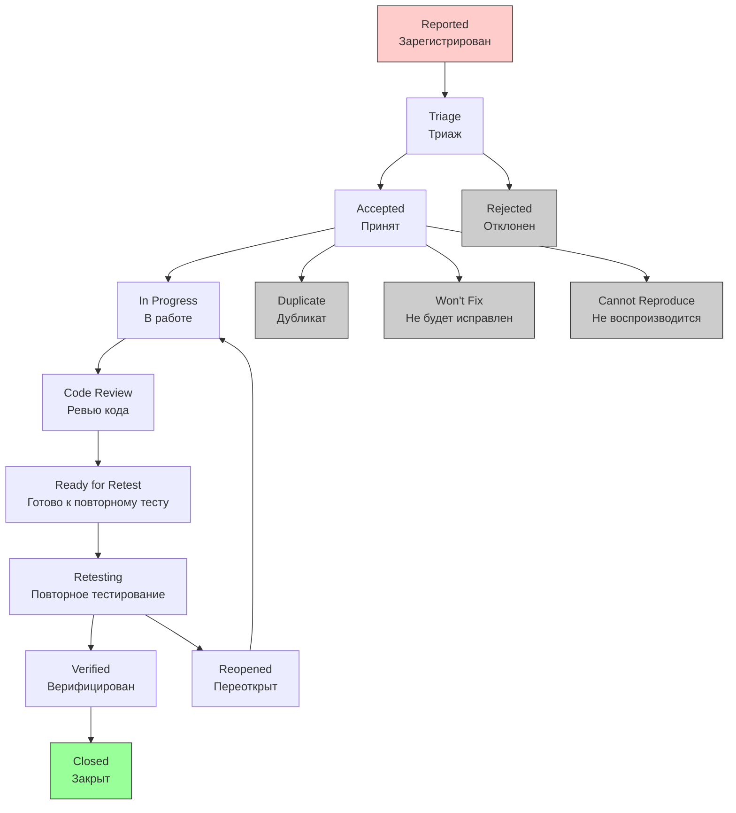

# Workflow для Bug

## Особенности Bug Workflow

1. Urgency-based (основан на срочности);
2. Quality focus (фокус на качестве);
3. Reproducibility critical (воспроизводимость критична);
4. Regression prevention (предотвращение регрессии).

## Детальный Workflow для Bug



## Подробное описание каждого статуса

### 1. Reported (Зарегистрирован)

```text
Описание: Баг обнаружен и зарегистрирован
Кто создает: QA Engineer, Пользователь, Разработчик
Поля ОБЯЗАТЕЛЬНЫЕ для баг-репорта:
  - Шаги воспроизведения
  - Ожидаемый результат
  - Фактический результат
  - Окружение
  - Серьезность (Severity)
  - Приоритет (Priority)
  
Качество баг-репорта:
  - Clear reproduction steps
  - Screenshots/videos
  - Console logs
  - System information
  
Возможные действия:
  → Triage (Триаж): Передать на анализ
  → Reject (Отклонить): Некорректный репорт
```

### 2. Triage (Триаж)

```text
Описание: Анализ и классификация бага
Кто делает: QA Lead, Product Owner, Tech Lead
Цели триажа:
  - Validate the bug (подтвердить баг)
  - Assess impact (оценить влияние)
  - Assign priority (назначить приоритет)
  - Identify root cause (определить корневую причину)
  
Поля обязательные:
  - Triage Notes (заметки триажа)
  - Root Cause (корневая причина)
  - Impact Assessment (оценка влияния)
  
Возможные действия:
  → Accept (Принять): Баг валиден и требует исправления
  → Reject (Отклонить): Не баг или не воспроизводится
  → Mark Duplicate (Пометить дубликатом): Уже зарегистрирован
  → Defer (Отложить): Исправить позже
```

### 3. Accepted (Принят)

```text
Описание: Баг подтвержден и принят к исправлению
Поля обязательные:
  - Assigned To (назначен кому)
  - Target Sprint (целевой спринт)
  - Estimated Fix Time (оценка времени исправления)
  
Критерии для перехода в работу:
  - Воспроизводимость подтверждена
  - Приоритет установлен
  - Влияние оценено
  - Исполнитель назначен
  
Возможные действия:
  → Start Fix (Начать исправление): Разработчик начинает работу
  → Defer (Отложить): Низкий приоритет
```

### 4. In Progress (В работе)

```text
Описание: Разработчик исправляет баг
Кто работает: Назначенный разработчик
Поля обязательные:
  - Fix Description (описание исправления)
  - Code Changes (изменения кода)
  - Root Cause Analysis (анализ причины)
  
Best Practices:
  - Write regression tests
  - Document the fix
  - Consider similar issues
  
Возможные действия:
  → Ready for Review (Готово к ревью): Исправление готово
  → Cannot Fix (Невозможно исправить): Технические ограничения
```

### 5. Code Review (Ревью кода)

```text
Описание: Проверка исправления
Фокус ревью для багов:
  - Fix addresses root cause (исправляет причину)
  - No new issues introduced (не вносит новых проблем)
  - Tests cover the scenario (тесты покрывают сценарий)
  
Поля обязательные:
  - Reviewer Feedback (обратная связь ревьюера)
  - Security Review (проверка безопасности)
  
Возможные действия:
  → Approve (Одобрить): Исправление корректно
  → Request Changes (Запросить изменения): Требуются доработки
```

### 6. Ready for Retest (Готово к повторному тесту)

```text
Описание: Исправление готово для проверки
Поля обязательные:
  - Build Version (версия сборки)
  - Test Environment (окружение для теста)
  - Special Instructions (особые инструкции)
  
Автоматические действия:
  - Развертывание на тестовом окружении
  - Уведомление QA команды
  - Запуск регрессионных тестов
  
Возможные действия:
  → Start Retest (Начать повторное тестирование)
```

### 7. Retesting (Повторное тестирование)

```text
Описание: Проверка исправления
Кто тестирует: Изначальный репортер или QA
Поля обязательные:
  - Retest Results (результаты повторного теста)
  - Regression Test Results (результаты регрессионных тестов)
  
Процесс проверки:
  1. Воспроизвести оригинальные шаги
  2. Проверить что баг исправлен
  3. Выполнить регрессионное тестирование
  4. Проверить смежные функциональности
  
Возможные действия:
  → Verify (Верифицировать): Баг исправлен
  → Reopen (Переоткрыть): Баг не исправлен
```

### 8. Verified (Верифицирован)

```text
Описание: Исправление подтверждено
Поля обязательные:
  - Verified By (кто подтвердил)
  - Verification Date (дата подтверждения)
  - Release Version (версия релиза)
  
Критерии верификации:
  - Original issue resolved
  - No regression introduced
  - Documentation updated
  - Tests added to prevent recurrence
  
Возможные действия:
  → Close (Закрыть): Финальное закрытие бага
```

### 9. Closed (Закрыт)

```text
Описание: Баг полностью исправлен и закрыт
Поля обязательные:
  - Resolution (резолюция: Fixed)
  - Fix Version (версия исправления)
  - Closing Comments (заключительные комментарии)
  
Финальные действия:
  - Update bug tracking metrics
  - Notify stakeholders
  - Archive related documents
```

## Альтернативные статусы завершения:

### Duplicate (Дубликат):

```text
Описание: Баг уже зарегистрирован
Поля обязательные:
  - Original Issue Key (ключ оригинального бага)
  - Duplicate Reason (причина дублирования)
```

### Won't Fix (Не будет исправлен):

```text
Описание: Решение не исправлять баг
Причины:
  - Low impact (низкое влияние)
  - Too expensive to fix (слишком дорого исправлять)
  - By design (так и задумано)
  - Obsolete feature (устаревшая функциональность)
  
Поля обязательные:
  - Business Justification (бизнес-обоснование)
  - Alternative Solution (альтернативное решение)
```

### Cannot Reproduce (Не воспроизводится)

```text
Описание: Не удается воспроизвести баг
Поля обязательные:
  - Attempts Made (попытки воспроизведения)
  - Environments Tested (проверенные окружения)
  - Additional Information Requested (запрошенная доп. информация)
```

## Условия перехода для Bug

```yaml
"Triage":
  Conditions:
    - Только пользователи из групп: "QA Lead", "Product Owner", "Tech Lead"
    - Баг должен иметь заполненные обязательные поля
  Validators:
    - Поле "Steps to Reproduce" не должно быть пустым
    - Должны быть указаны "Actual Result" и "Expected Result"
  Post Functions:
    - Отправить уведомление триаж-группе
    - Установить приоритет на основе серьезности

"Accept":
  Conditions:
    - Баг должен быть в статусе "Triage"
    - Воспроизводимость должна быть подтверждена
  Validators:
    - Должен быть указан "Root Cause"
    - Должна быть заполнена "Impact Assessment"
  Post Functions:
    - Автоматически назначить разработчика по ротации
    - Установить дедлайн на основе серьезности
    - Отправить уведомление назначенному разработчику

"Reopen":
  Conditions:
    - Только пользователь, который верифицировал баг или создатель
    - Баг должен быть в статусе "Verified" или "Closed"
  Validators:
    - Должны быть предоставлены доказательства, что баг не исправлен
    - Должно быть описание почему предыдущее исправление не работает
  Post Functions:
    - Увеличить счетчик reopen
    - Обновить серьезность если проблема усугубилась
    - Уведомить оригинального разработчика
```

## Автоматизация Bug Workflow

```python
# Пример автоматической оценки серьезности бага
def calculate_bug_severity(bug_data):
    severity_score = 0
    
    # Факторы, влияющие на серьезность
    factors = {
        'data_loss': 100,        # Потеря данных
        'security': 90,          # Проблемы безопасности
        'crash': 80,            # Крах системы
        'core_functionality': 70, # Основная функциональность
        'ui_issue': 30,         # Проблемы UI
        'cosmetic': 10          # Косметические проблемы
    }
    
    # Частота возникновения
    frequency_multiplier = {
        'always': 1.0,
        'often': 0.8,
        'sometimes': 0.5,
        'rarely': 0.2
    }
    
    # Расчет оценки
    for factor, weight in factors.items():
        if bug_data.get(factor, False):
            severity_score += weight
    
    # Учет частоты
    frequency = bug_data.get('frequency', 'sometimes')
    severity_score *= frequency_multiplier.get(frequency, 0.5)
    
    # Определение уровня серьезности
    if severity_score >= 80:
        return 'Critical'
    elif severity_score >= 50:
        return 'High'
    elif severity_score >= 20:
        return 'Medium'
    else:
        return 'Low'

# Автоматическое назначение приоритета на основе серьезности
def assign_bug_priority(severity, impact_users, business_criticality):
    priority_matrix = {
        'Critical': {
            'high_impact': 'P1',
            'medium_impact': 'P1',
            'low_impact': 'P2'
        },
        'High': {
            'high_impact': 'P2',
            'medium_impact': 'P2',
            'low_impact': 'P3'
        },
        'Medium': {
            'high_impact': 'P3',
            'medium_impact': 'P4',
            'low_impact': 'P4'
        },
        'Low': {
            'high_impact': 'P4',
            'medium_impact': 'P4',
            'low_impact': 'P4'
        }
    }
    
    impact_level = 'high_impact' if impact_users > 1000 else \
                   'medium_impact' if impact_users > 100 else \
                   'low_impact'
    
    # Повышение приоритета для бизнес-критичных функций
    if business_criticality == 'high':
        priority = priority_matrix[severity][impact_level]
        # Повышаем на один уровень
        priority_map = {'P1': 'P1', 'P2': 'P1', 'P3': 'P2', 'P4': 'P3'}
        return priority_map[priority]
    
    return priority_matrix[severity][impact_level]
```
