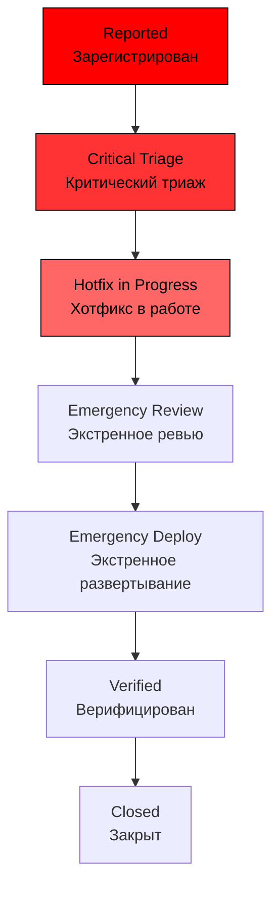

# Ускоренный Workflow для Critical Bugs

## Особенности

- Максимальное время на каждом этапе: 2-4 часа;
- Автоматическое оповещение on-call инженеров;
- Обход стандартных проверок;
- Прямое развертывание в production.
