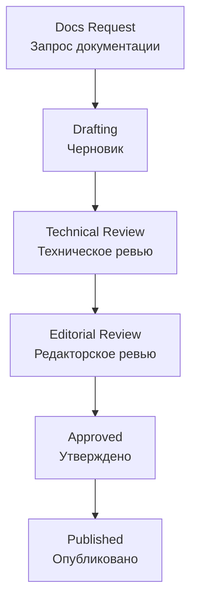

# Workflow для Documentation Tasks

```mermaid
graph TD
    A[Docs Request<br/>Запрос документации] --> B[Drafting<br/>Черновик]
    B --> C[Technical Review<br/>Техническое ревью]
    C --> D[Editorial Review<br/>Редакторское ревью]
    D --> E[Approved<br/>Утверждено]
    E --> F[Published<br/>Опубликовано]
```

## Особенности

- Multiple review cycles;
- Different reviewers for technical vs editorial;
- Version control for documentation;
- Publication workflow.
