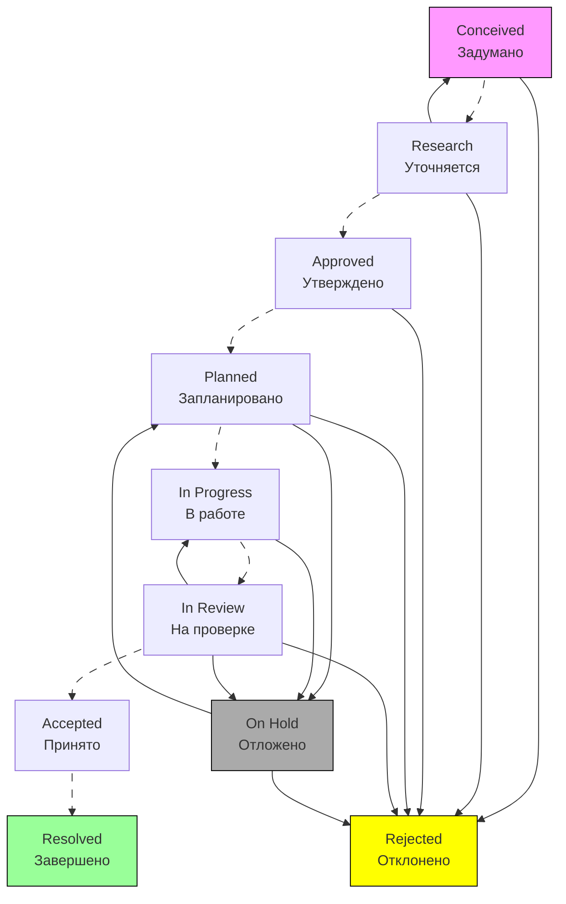

# Workflow для Epic



## Подробное описание каждого статуса

### 1. Conceived (Задумано)

```text
Описание: Идея появилась, но не формализована
Кто создает: Product Owner, Stakeholder
Поля обязательные:
  - Название Epic
  - Идея (1-2 предложения)
  - Business Value (предполагаемый)
  
Возможные действия:
  → Research (Уточнить): Product Owner начинает исследование
  → Reject (Отклонить): Идея не актуальна
```

### 2. Research (Уточняется)

```text
Описание: Детализация и исследование Epic
Кто работает: Product Owner, Business Analyst
Поля обязательные:
  - Business Case (обоснование)
  - Предварительная оценка (story points)
  - Риски и зависимости
  - Предполагаемые Stories
  
Проверки:
  - Есть ли MVP?
  - Соответствует ли стратегии?
  - Достаточно ли ресурсов?
  
Возможные действия:
  → Approve (Утвердить): Готово для планирования
  → Reject (Отклонить): Не соответствует критериям
  → Return to Conceive (Вернуть): Нужна доп. информация
```

### 3. Approved (Утверждено)

```text
Описание: Epic утвержден бизнесом для реализации
Кто утверждает: Steering Committee, Product Council
Поля обязательные:
  - Approved By (кто утвердил)
  - Approval Date (дата утверждения)
  - Budget (бюджет если есть)
  - Success Metrics (метрики успеха)
  
Триггеры:
  - Создание Stories под Epic
  - Уведомление командам
  - Добавление в Roadmap
  
Возможные действия:
  → Plan (Запланировать): Назначить на квартал/релиз
  → Reject (Отклонить): Отмена утверждения (редко)
```

### 4. Planned (Запланировано)

```text
Описание: Epic включен в план релиза/квартала
Кто планирует: Product Owner, Release Manager
Поля обязательные:
  - Target Release (целевой релиз)
  - Priority (приоритет)
  - Dependencies (зависимости)
  - Team Assignment (назначенные команды)
  
Автоматические действия:
  - Создание связанных Stories
  - Назначение Epic Owner
  - Обновление Roadmap
  
Возможные действия:
  → Start Progress (Начать): Начало работы команд
  → Put on Hold (Приостановить): Изменение приоритетов
  → Reject (Отклонить): Выведение из плана
```

### 5. In Progress (В работе)

```text
Описание: Команды работают над Epic
Кто работает: Все назначенные команды
Поля обязательные:
  - Progress (% завершения)
  - Blockers (блокировки)
  - Last Updated (последнее обновление)
  
Мониторинг:
  - Еженедельные статус.встречи
  - Отслеживание метрик
  - Управление рисками
  
Возможные действия:
  → Submit for Review (На проверку): Готово к Gate Review
  → Put on Hold (Приостановить): Возникли проблемы
```

### 6. In Review (На проверке)

```text
Описание: Gate Review перед завершением
Кто проверяет: Product Owner, Stakeholders
Поля обязательные:
  - Review Notes (заметки по проверке)
  - Acceptance Criteria Met? (критерии выполнены?)
  - Business Value Delivered? (ценность доставлена?)
  
Проверки (Gate Criteria):
  - [ ] Все Stories завершены
  - [ ] Метрики успеха достигнуты
  - [ ] Пользовательские тесты пройдены
  - [ ] Документация обновлена
  
Возможные действия:
  → Accept (Принять): Epic соответствует критериям
  → Return to Progress (Вернуть): Требуются доработки
  → Put on Hold (Приостановить): Требуются доп. ресурсы
  → Reject (Отклонить): Не соответствует критериям
```

### 7. On Hold (Приостановлено)

```text
Описание: Epic временно приостановлен
Причины:
  - Изменение бизнес-приоритетов
  - Технические блокировки
  - Нехватка ресурсов
  - Зависимости от других Epic
  
Поля обязательные:
  - Hold Reason (причина приостановки)
  - Expected Resume Date (ожидаемая дата возобновления)
  - Impact Assessment (оценка влияния)
  
Возможные действия:
  → Resume Progress (Возобновить): Проблемы решены
  → Cancel (Отменить): Epic больше не актуален
```

### 8. Accepted (Принято)

```text
Описание: Epic успешно завершен и принят бизнесом
Поля обязательные:
  - Actual Business Value (фактическая ценность)
  - Lessons Learned (извлеченные уроки)
  - Retrospective Notes (заметки ретроспективы)
  
Автоматические действия:
  - Закрытие всех связанных Stories
  - Отправка отчетов Stakeholders
  - Архивирование документации
  
Возможные действия:
  → Done (Завершить): Финальное закрытие Epic
```

### 9. Resolved (Завершено)

```text
Описание: Epic полностью завершен
Критерии:
  - Все Stories закрыты
  - Документация обновлена
  - Метрики зафиксированы
  - Знания переданы
  
Поля обязательные:
  - Completion Date (дата завершения)
  - Post-Implementation Review (обзор после внедрения)
  - Next Steps (следующие шаги)
  
Финальные действия:
  - Epic архивируется
  - Результаты добавляются в базу знаний
  - Уведомление всех Stakeholders
```

### 10. Rejected (Отклонено)

```text
Описание: Epic отклонен на любом этапе
Причины:
  - Не соответствует стратегии
  - ROI недостаточный
  - Техническая невозможность
  - Изменение рынка/конкурентов
  
Поля обязательные:
  - Rejection Reason (причина отклонения)
  - Alternative Solutions (альтернативные решения)
  - Learnings (что узнали)
  
Возможные действия:
  → Archive (Архивировать): Сохранить для истории
```

## Условия перехода для Epic

```yaml
"Start Progress":
  Conditions:
    - Epic должен быть в статусе "Planned"
    - Все зависимости разрешены
    - Ресурсы подтверждены
  Validators:
    - Поле "Target Release" должно быть заполнено
    - Поле "Team Assignment" должно содержать минимум 1 команду
  Post Functions:
    - Создать подзадачи (Stories) если их нет
    - Назначить Epic Owner если не назначен
    - Отправить уведомление командам

"Submit for Review":
  Conditions:
    - Все Stories должны быть в статусе "Done"
    - Progress = 100%
  Validators:
    - Поле "Progress" должно быть 100%
    - Должен быть заполнен "Implementation Report"
  Post Functions:
    - Создать событие в календаре для Gate Review
    - Отправить приглашение Stakeholders

"Accept":
  Conditions:
    - Только пользователи с ролью "Product Owner" или выше
    - Epic должен пройти Gate Review
  Validators:
    - Все Acceptance Criteria должны быть отмечены как выполненные
    - Поле "Business Value Delivered" должно быть заполнено
  Post Functions:
    - Обновить KPI/OKR панель
    - Закрыть все связанные задачи
    - Отправить отчет о завершении
```

## Автоматизация Epic Workflow

```sql
-- Пример триггеров в базе данных (если используется)
CREATE OR REPLACE FUNCTION epic_status_change_trigger()
RETURNS TRIGGER AS $$
BEGIN
    -- При переходе в In Progress
    IF NEW.status = 'In Progress' AND OLD.status != 'In Progress' THEN
        -- Автоматически создаем Stories если их нет
        IF NOT EXISTS (SELECT 1 FROM issues WHERE epic_link = NEW.key) THEN
            PERFORM create_default_stories_for_epic(NEW.key);
        END IF;
        
        -- Логируем начало работы
        INSERT INTO epic_activity_log (epic_key, action, timestamp)
        VALUES (NEW.key, 'Epic work started', NOW());
    END IF;
    
    -- При завершении Epic
    IF NEW.status = 'Done' THEN
        -- Проверяем что все Stories завершены
        IF EXISTS (
            SELECT 1 FROM issues 
            WHERE epic_link = NEW.key 
            AND status NOT IN ('Done', 'Closed')
        ) THEN
            RAISE EXCEPTION 'Cannot complete Epic with unfinished Stories';
        END IF;
        
        -- Обновляем метрики
        UPDATE epic_metrics 
        SET completion_date = NOW(),
            actual_duration = AGE(NOW(), NEW.created_at)
        WHERE epic_key = NEW.key;
    END IF;
    
    RETURN NEW;
END;
$$ LANGUAGE plpgsql;
```
