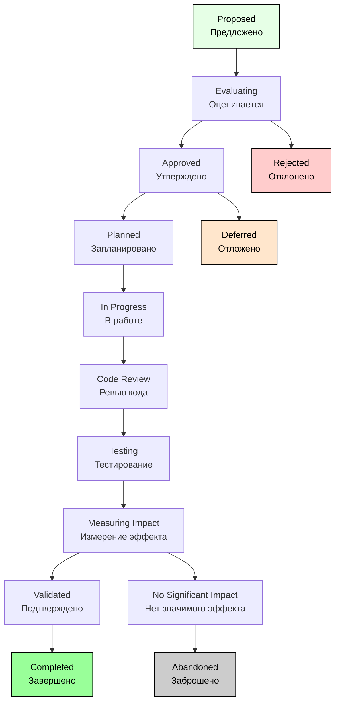

# Workflow для Improvement

## Особенности Improvement Workflow

1. Value-driven (основан на ценности);
2. ROI focused (фокус на возврате инвестиций);
3. Optional (опциональный, не критичный);
4. Evolutionary (эволюционный, а не исправление).

## Детальный Workflow для Improvement



## Подробное описание каждого статуса:

### 1. Proposed (Предложено)

```text
Описание: Предложение по улучшению
Кто предлагает: Любой член команды, пользователь
Поля обязательные:
  - Current State (текущее состояние)
  - Proposed Improvement (предлагаемое улучшение)
  - Expected Benefits (ожидаемые выгоды)
  - Metrics for Measurement (метрики для измерения)
  
Качество предложения:
  - Clear problem statement
  - Data-driven proposal
  - Measurable outcomes
  - Estimated effort
  
Возможные действия:
  → Evaluate (Оценить): Передать на оценку
  → Reject (Отклонить): Не подходящее предложение
```

### 2. Evaluating (Оценивается)

```text
Описание: Оценка предложения
Кто оценивает: Product Owner, Tech Lead, Business Analyst
Поля обязательные:
  - ROI Analysis (анализ ROI)
  - Technical Feasibility (техническая осуществимость)
  - Resource Requirements (требования к ресурсам)
  - Risk Assessment (оценка рисков)
  
Метрики для оценки:
  - Cost vs Benefit (стоимость vs выгода)
  - Implementation Complexity (сложность реализации)
  - User Impact (влияние на пользователей)
  - Strategic Alignment (соответствие стратегии)
  
Возможные действия:
  → Approve (Утвердить): Улучшение одобрено
  → Reject (Отклонить): Недостаточный ROI
  → Request More Info (Запросить доп. информацию)
```

### 3. Approved (Утверждено)

```text
Описание: Улучшение утверждено для реализации
Поля обязательные:
  - Priority (приоритет)
  - Target Timeline (целевые сроки)
  - Success Metrics (метрики успеха)
  - Assigned Team (назначенная команда)
  
Критерии утверждения:
  - Positive ROI
  - Aligns with strategy
  - Resources available
  - Acceptable risk level
  
Возможные действия:
  → Plan (Запланировать): Включить в план
  → Defer (Отложить): Утверждено, но не сейчас
```

### 4. Planned (Запланировано)

```text
Описание: Улучшение включено в план работ
Поля обязательные:
  - Sprint/Release (спринт/релиз)
  - Dependencies (зависимости)
  - Implementation Plan (план реализации)
  
Planning considerations:
  - Not blocking critical work
  - Can be deprioritized if needed
  - Clear success criteria
  
Возможные действия:
  → Start Implementation (Начать реализацию)
  → Defer (Отложить): Изменение приоритетов
```

### 5. In Progress (В работе)

```text
Описание: Реализация улучшения
Отличия от Bug/Story implementation:
  - More experimental approach
  - A/B testing可能
  - Gradual rollout
  
Поля обязательные:
  - Implementation Approach (подход к реализации)
  - Experiment Design (дизайн эксперимента)
  - Rollout Plan (план внедрения)
  
Возможные действия:
  → Ready for Review (Готово к ревью)
```

### 6. Code Review (Ревью кода)

```text
Описание: Проверка реализации улучшения
Фокус ревью:
  - Performance implications
  - No negative impact on existing functionality
  - Clean, maintainable code
  
Возможные действия:
  → Approve (Одобрить)
  → Request Changes (Запросить изменения)
```

### 7. Testing (Тестирование)

```text
Описание: Проверка улучшения
Особенности тестирования:
  - A/B testing setup
  - Performance testing
  - User acceptance testing
  
Поля обязательные:
  - Test Results (результаты тестов)
  - User Feedback (обратная связь пользователей)
  
Возможные действия:
  → Ready for Measurement (Готово к измерению эффекта)
```

### 8. Measuring Impact (Измерение эффекта)

```text
Описание: Измерение эффекта от улучшения
Поля обязательные:
  - Baseline Metrics (базовые метрики)
  - Post-Implementation Metrics (метрики после внедрения)
  - Statistical Significance (статистическая значимость)
  
Метрики для измерения:
  - Performance metrics
  - User engagement
  - Business metrics
  - System metrics
  
Возможные действия:
  → Validate (Подтвердить): Эффект подтвержден
  → No Impact (Нет эффекта): Улучшение не дало результата
```

### 9. Validated (Подтверждено)

```text
Описание: Эффект улучшения подтвержден
Поля обязательные:
  - Actual ROI (фактический ROI)
  - Lessons Learned (извлеченные уроки)
  - Recommendations (рекомендации)
  
Критерии валидации:
  - Measurable improvement
  - Positive user feedback
  - Acceptable implementation cost
  
Возможные действия:
  → Complete (Завершить): Финальное завершение
```

### 10. Completed (Завершено)

```text
Описание: Улучшение успешно завершено
Поля обязательные:
  - Final Report (финальный отчет)
  - Knowledge Transfer (передача знаний)
  - Future Recommendations (рекомендации на будущее)
  
Финальные действия:
  - Update best practices
  - Share results with team
  - Archive documentation
```

## Условия перехода для Improvement:

```yaml
"Evaluate":
  Conditions:
    - Пользователь должен иметь право оценивать улучшения
    - Должны быть заполнены все обязательные поля предложения
  Validators:
    - Должны быть указаны "Expected Benefits"
    - Должны быть предложены "Metrics for Measurement"
  Post Functions:
    - Автоматически назначить оценщиков
    - Установить дедлайн для оценки (14 дней)
    - Отправить уведомление команде оценки

"Approve":
  Conditions:
    - Минимум 2 из 3 оценщиков должны одобрить
    - ROI должен быть положительным
  Validators:
    - Поле "ROI Analysis" должно быть заполнено
    - Должна быть проведена "Risk Assessment"
  Post Functions:
    - Создать связанную Story/Task для реализации
    - Добавить в бэклог продукта с низким приоритетом
    - Уведомить автора предложения

"Measure Impact":
  Conditions:
    - Улучшение должно быть реализовано и протестировано
    - Должен быть установлен период измерения (минимум 2 недели)
  Validators:
    - Должны быть собраны baseline метрики
    - Должен быть определен метод измерения
  Post Functions:
    - Запустить сбор метрик
    - Установить напоминание для анализа результатов
    - Уведомить аналитиков о начале измерения
```
