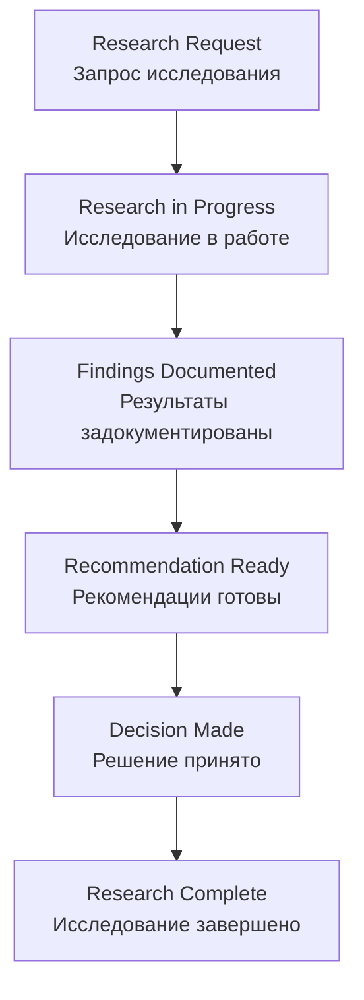

# Workflow для Research/Spike Tasks

```mermaid
graph TD
    A[Research Request<br/>Запрос исследования] --> B[Research in Progress<br/>Исследование в работе]
    B --> C[Findings Documented<br/>Результаты задокументированы]
    C --> D[Recommendation Ready<br/>Рекомендации готовы]
    D --> E[Decision Made<br/>Решение принято]
    E --> F[Research Complete<br/>Исследование завершено]
```

## Особенности

- Time-boxed (обычно 1-3 дня)
- Focus on learning, not delivery
- Output: документация, рекомендации
- May lead to new Stories/Epics.
