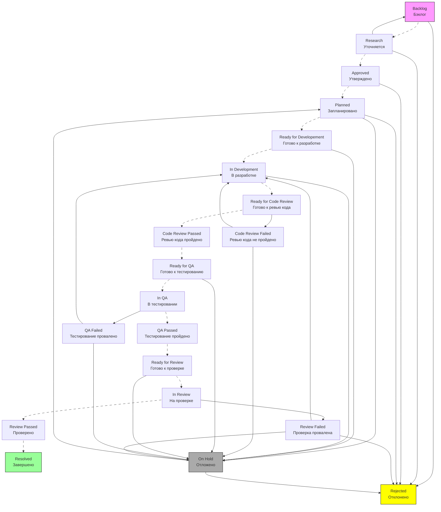

# Workflow для Story

## Особенности Story Workflow

- User-centric (фокус на пользователя);
- Time-boxed (обычно 1 спринт);
- Test-driven (критерии приемки);
- Value-focused (измеримая ценность).

## Детальный Workflow для Story



## Подробное описание каждого статуса

### 1. Backlog (Бэклог)

```text
Описание: Идея для Story, но без деталей
Кто создает: Product Owner, Business Analyst
Поля обязательные:
  - User Story формулировка
  - Предполагаемая ценность
  - Приоритет (MoSCoW: Must, Should, Could, Won't)
  
Качество Backlog Item:
  - Независимая (Independent)
  - Обсуждаемая (Negotiable)
  - Ценная (Valuable)
  - Оцениваемая (Estimable)
  - Маленькая (Small)
  - Тестируемая (Testable) - INVEST критерии
  
Возможные действия:
  → Research (Уточнить): Перейти к детализации
  → Reject (Отклонить): Не подходит для реализации
```

### 2. Research (Уточняется)

```text
Описание: Story детализирована и готова для оценки
Кто работает: Product Owner, Business Analyst, Development Team
Поля обязательные:
  - Детальное описание
  - Acceptance Criteria (критерии приемки)
  - Предварительные Story Points
  - Технические заметки
  
Выход Refinement:
  - Clear Acceptance Criteria
  - Story Points оценка
  - Technical Spikes если нужно
  - Dependencies identified
  
Возможные действия:
  → Approve (Утвердить): Готова для планирования спринта
  → Return to Backlog (Вернуть): Требуется больше информации
  → Reject (Отклонить): Не соответствует критериям
```

### 3. Approved (Утверждено)

```text
Описание: История утверждена для планирования
Кто утверждает: ___
Поля обязательные:
  - Approved By (кто утвердил)
  - Approval Date (дата утверждения)
  - Budget (бюджет если есть)
  - Success Metrics (метрики успеха)
  
Триггеры:
  - Создание Tasks под Story
  - Уведомление командам
  - Добавление в Roadmap
  
Возможные действия:
  → Plan (Запланировать): Назначить на спринт
  → Reject (Отклонить): Отмена утверждения (редко)
```

### 4. Planned (Запланировано)

```text
Описание: История включена в план спринта
Кто планирует: ___
Поля обязательные:
  - Target Release (целевой релиз)
  - Priority (приоритет)
  - Dependencies (зависимости)
  - Team Assignment (назначенные команды)
  
Автоматические действия:
  - Создание связанных Tasks
  - Назначение Story Owner
  - Обновление Roadmap
  
Возможные действия:
  → Start Develope (Начать): Начало работы команд
  → Put on Hold (Приостановить): Изменение приоритетов
  → Reject (Отклонить): Выведение из плана
```

### 5. Ready for Developement (Готово к разработке)

```text
Описание: Story готова для взятия в спринт
Критерии готовности (Definition of Ready):
  - [ ] Acceptance Criteria четко определены
  - [ ] Дизайн готов (если требуется)
  - [ ] Зависимости разрешены
  - [ ] Story Points оценены командой
  - [ ] Тестовые данные подготовлены
  
Поля обязательные:
  - Story Points (финальная оценка)
  - Assigned Sprint (назначенный спринт)
  - Dependencies Resolved (зависимости разрешены)
  
Возможные действия:
  → Start Development (Начать разработку): Разработчик берет в работу
  → Put on hold (Отложить): Требуются изменения
```

### 6. In Development (В разработке)

```text
Описание: Разработка в процессе
Кто работает: Developer(s)
Поля обязательные:
  - Assignee (исполнитель)
  - Time Spent (затраченное время)
  - Branch Name (имя ветки Git)
  - PR Link (ссылка на Pull Request)
  
Стандарты разработки:
  - Code follows style guide
  - Unit tests written
  - Documentation updated
  - Peer review planned
  
Возможные действия:
  → Submit for Code Review (На ревью кода): Код готов для проверки
  → Put on hold (Отложить): Возникли проблемы
```

### 7. Ready for Code Review (Ревью кода)

```text
Описание: Код проверяется другими разработчиками
Кто проверяет: 1-2 других разработчика
Поля обязательные:
  - Reviewer(s) (ревьюеры)
  - Review Comments (комментарии ревью)
  - Required Changes (требуемые изменения)
  
Критерии Code Review:
  - [ ] Code quality (качество кода)
  - [ ] Test coverage (покрытие тестами)
  - [ ] Security considerations (безопасность)
  - [ ] Performance implications (производительность)
  
Возможные действия:
  → Ready for QA (Одобрить): Код прошел ревью и готов к тестированию
  → Request Changes (Запросить изменения): Требуются правки
```

### 8. Ready for QA (Готово к тестированию)

```text
Описание: Код прошел ревью и готов к тестированию.
Поля обязательные:
  - Build Version (версия сборки)
  - Deployment Environment (окружение)
  - Test Instructions (инструкции для тестирования)
  
Автоматические действия:
  - Запуск автоматических тестов
  - Развертывание на тестовом окружении
  - Уведомление QA команды
  
Возможные действия:
  → Start QA (Начать тестирование): QA инженер берет в работу
  → Put on hold (Отложить): Изменились приоритеты
```

### 9. In QA (В тестировании)

```text
Описание: Функциональное тестирование.
Кто тестирует: QA Engineer.
Поля обязательные:
  - Tester (тестировщик)
  - Test Results (результаты тестов)
  - Defects Found (найденные дефекты)
  
Виды тестирования:
  - Functional testing (функциональное)
  - Regression testing (регрессионное)
  - Integration testing (интеграционное)
  - UX testing (пользовательское)
  
Возможные действия:
  → QA Pass (Тестирование пройдено): Все тесты пройдены
  → QA Fail (Тестирование провалено): Найдены проблемы
```

### 10. QA Passed (Тестирование пройдено)

```text
Описание: Все тесты успешно пройдены
Поля обязательные:
  - Test Coverage (покрытие тестами)
  - Defect Count (количество дефектов)
  - Test Environment (окружение тестирования)
  
Автоматические действия:
  - Создание тестовой документации
  - Обновление тестовых сценариев
  - Отметка связанных багов как исправленных
  
Возможные действия:
  → Submit for Review (На проверку): Готово для приемки
```

### 11. Ready for Review (Готово к проверке)

```text
Описание: Готово для приемки Product Owner
Поля обязательные:
  - Demo Prepared? (демо подготовлено?)
  - Documentation Updated (документация обновлена)
  - Release Notes (заметки о релизе)
  
Подготовка к Review:
  - Demo environment ready
  - Acceptance criteria checklist
  - User documentation ready
  
Возможные действия:
  → Start Review (Начать проверку): PO начинает проверку
  → Put on hold (Отложить): Изменились приоритеты
```

### 12. In Review (Проверка)

```text
Описание: Product Owner проверяет реализацию
Кто проверяет: Product Owner, Stakeholders
Поля обязательные:
  - PO Feedback (обратная связь PO)
  - Acceptance Verified? (критерии проверены?)
  - Business Value Confirmed (ценность подтверждена)
  
Checklist для PO:
  - [ ] All acceptance criteria met
  - [ ] UI/UX matches expectations
  - [ ] Performance acceptable
  - [ ] No regression issues
  
Возможные действия:
  → Review Pass (Принять): Story соответствует ожиданиям
  → Review Fail (Запросить изменения): Требуются доработки
```

### 13. Review Passed (Проверка пройдена)

```text
Описание: Все проверки успешно пройдены
Поля обязательные:
  - Review Notes (заметки по проверке)
  - Acceptance Criteria Met? (критерии выполнены?)
  
Проверки (Gate Criteria):
  - [ ] Все Stories завершены
  - [ ] Метрики успеха достигнуты
  - [ ] Пользовательские тесты пройдены
  - [ ] Документация обновлена
  
Возможные действия:
  → Accept (Принято): Story соответствует критериям
```

### 14. Resolved (Завершено)

```text
Описание: Story полностью завершена
Definition of Done (критерии завершения):
  - [ ] Code completed and reviewed
  - [ ] Tests written and passing
  - [ ] QA verified
  - [ ] Product Owner accepted
  - [ ] Documentation updated
  - [ ] Deployed to production (если применимо)
  
Поля обязательные:
  - Actual Story Points (фактические story points)
  - Completion Date (дата завершения)
  - Retrospective Notes (заметки ретроспективы)
  
Финальные действия:
  - Story архивируется
  - Velocity пересчитывается
  - Прогресс Epic обновляется
```

## Условия перехода для Story

```yaml
"Start Development":
  Conditions:
    - Пользователь должен быть в группе "Developers"
    - Story должна быть в статусе "Ready for Dev"
    - Story должна иметь назначенный спринт
  Validators:
    - Поле "Story Points" должно быть заполнено
    - Все обязательные поля "Acceptance Criteria" должны быть заполнены
  Post Functions:
    - Автоматически назначить исполнителя (если не назначен)
    - Обновить поле "Started Date"
    - Отправить уведомление о начале работы

"Submit for Code Review":
  Conditions:
    - Исполнитель должен быть разработчиком Story
    - Должна быть ссылка на Pull Request
  Validators:
    - Поле "PR Link" должно быть валидным URL
    - Поле "Time Spent" должно быть заполнено
  Post Functions:
    - Назначить случайных ревьюеров из группы "Developers"
    - Создать комментарий с просьбой о ревью
    - Отправить уведомление в Slack/Teams

"QA Pass":
  Conditions:
    - Пользователь должен быть в группе "QA"
    - Все обязательные тесты должны быть пройдены
  Validators:
    - Поле "Test Results" должно быть заполнено
    - Поле "Defect Count" должно быть 0 или все дефекты закрыты
  Post Functions:
    - Обновить поле "QA Pass Date"
    - Создать автоматический отчет о тестировании
    - Уведомить Product Owner о готовности к проверке
```

## Автоматизация Story Workflow

```javascript
// Пример скрипта для автоматического создания подзадач
function createSubTasksForStory(storyKey) {
    const story = getIssue(storyKey);
    
    // Стандартный набор подзадач для Story
    const subTasks = [
        {
            summary: `Development: ${story.fields.summary}`,
            issueType: { name: 'Sub-task' },
            assignee: story.fields.assignee,
            description: 'Implement the story functionality'
        },
        {
            summary: `Unit Tests: ${story.fields.summary}`,
            issueType: { name: 'Sub-task' },
            assignee: story.fields.assignee,
            description: 'Write unit tests for the implementation'
        },
        {
            summary: `Code Review: ${story.fields.summary}`,
            issueType: { name: 'Sub-task' },
            description: 'Peer review of the implementation'
        },
        {
            summary: `QA Testing: ${story.fields.summary}`,
            issueType: { name: 'Sub-task' },
            description: 'Functional and regression testing'
        }
    ];
    
    subTasks.forEach(subTask => {
        const createdTask = createIssue({
            fields: {
                project: story.fields.project,
                parent: { key: storyKey },
                ...subTask
            }
        });
        
        // Логирование создания подзадачи
        console.log(`Created sub-task: ${createdTask.key}`);
    });
}
```
