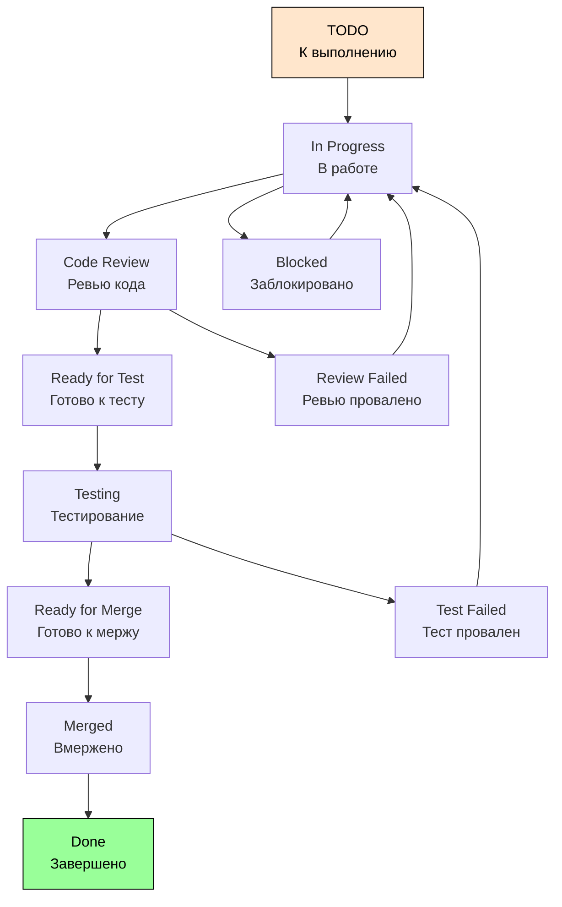

# Workflow для Task

## Особенности Task Workflow

1. Technical focus (техническая направленность);
2. Shorter duration (меньшая длительность);
3. Less ceremony (меньше формальностей);
4. Internal audience (внутренняя аудитория).

## Детальный Workflow для Task



## Подробное описание каждого статуса:

### 1. TODO (К выполнению)

```text
Описание: Задача создана и готова к работе
Кто создает: Разработчик, Тестировщик, DevOps
Поля обязательные:
  - Заголовок задачи
  - Описание (что нужно сделать)
  - Оценка времени (часы)
  - Приоритет
  
Критерии хорошей Task:
  - Четкая техническая спецификация
  - Измеримый результат
  - Реалистичная оценка времени
  - Минимум зависимостей
  
Возможные действия:
  → Start Work (Начать работу): Исполнитель берет задачу
  → Cancel (Отменить): Задача больше не актуальна
```

### 2. In Progress (В работе)

```text
Описание: Работа над задачей начата
Кто работает: Назначенный исполнитель
Поля обязательные:
  - Time Spent (затраченное время)
  - Progress Update (обновление прогресса)
  - Branch/PR если применимо
  
Best Practices:
  - Регулярно обновлять прогресс
  - Комментировать изменения
  - Отмечать блокировки сразу
  
Возможные действия:
  → Submit for Review (На ревью): Код готов к проверке
  → Block (Заблокировать): Возникли проблемы
```

### 3. Code Review (Ревью кода)

```text
Описание: Техническая проверка кода
Кто проверяет: Другой разработчик
Поля обязательные:
  - Reviewer (ревьюер)
  - PR Link (ссылка на Pull Request)
  - Review Notes (заметки ревью)
  
Фокус ревью для Task:
  - Code quality standards
  - No regression
  - Performance impact
  - Security considerations
  
Возможные действия:
  → Approve (Одобрить): Ревью пройдено
  → Request Changes (Запросить изменения): Требуются правки
```

### 4. Ready for Test (Готово к тесту)

```text
Описание: Код проверен и готов к тестированию
Поля обязательные:
  - Test Environment (окружение для теста)
  - Test Instructions (инструкции)
  
Когда требуется тестирование:
  - Изменения затрагивают существующую функциональность
  - Добавлена новая конфигурация
  - Изменения в инфраструктуре
  
Возможные действия:
  → Start Test (Начать тест): QA начинает тестирование
  → Skip Test (Пропустить тест): Для чисто технических задач
```

### 5. Testing (Тестирование)

```text
Описание: Проверка изменений
Кто тестирует: QA Engineer или разработчик
Поля обязательные:
  - Tester (тестировщик)
  - Test Results (результаты)
  
Виды тестирования для Task:
  - Smoke test (дымовое)
  - Regression test (регрессионное)
  - Integration test (интеграционное)
  
Возможные действия:
  → Test Pass (Тест пройден): Все проверки пройдены
  → Test Fail (Тест провален): Найдены проблемы
```

### 6. Ready for Merge (Готово к мержу)

```text
Описание: Все проверки пройдены, готово к слиянию
Поля обязательные:
  - Merge Target (ветка для мержа)
  - Deployment Plan (план развертывания)
  
Автоматические проверки:
  - Все тесты пройдены
  - Ревью одобрено
  - Конфликтов нет
  - CI/CD pipeline green
  
Возможные действия:
  → Merge (Смержить): Выполнить слияние кода
```

### 7. Merged (Смержено)

```text
Описание: Код успешно смержен
Поля обязательные:
  - Merge Date (дата мержа)
  - Merge Commit (коммит мержа)
  - Deployment Status (статус развертывания)
  
Post-merge действия:
  - Закрытие Pull Request
  - Удаление feature branch
  - Запуск deployment pipeline
  
Возможные действия:
  → Mark Done (Пометить завершенной): Переход в финальный статус
```

### 8. Done (Завершено)

```text
Описание: Задача полностью завершена
Definition of Done для Task:
  - [ ] Code implemented
  - [ ] Code reviewed
  - [ ] Tests passed (если применимо)
  - [ ] Code merged
  - [ ] Documentation updated
  
Поля обязательные:
  - Actual Time Spent (фактическое время)
  - Completion Date (дата завершения)
  
Финальные действия:
  - Обновление временных метрик
  - Уведомление заинтересованных лиц
```

## Условия перехода для Task:

```yaml
"Start Work":
  Conditions:
    - Пользователь должен быть назначенным исполнителем
    - Task не должна быть заблокирована
  Validators:
    - Поле "Time Estimate" должно быть заполнено
    - Должна быть указана ссылка на родительскую Story/Epic если есть
  Post Functions:
    - Установить поле "Start Date"
    - Добавить комментарий о начале работы
    - Отправить уведомление в канал команды

"Submit for Review":
  Conditions:
    - Исполнитель должен быть разработчиком
    - Должна быть заполнена ссылка на PR
  Validators:
    - Минимум 50% кода должно быть покрыто тестами
    - Build должен быть зеленым в CI
  Post Functions:
    - Автоматически назначить ревьюера
    - Создать напоминание на 24 часа
    - Обновить поле "Last Review Request"

"Merge":
  Conditions:
    - Только пользователи с правами merge в main branch
    - Все обязательные проверки должны быть пройдены
  Validators:
    - PR должен быть approved
    - Все тесты должны проходить
    - Нет конфликтов слияния
  Post Functions:
    - Закрыть связанный Pull Request
    - Удалить feature branch
    - Запустить deployment pipeline
```
